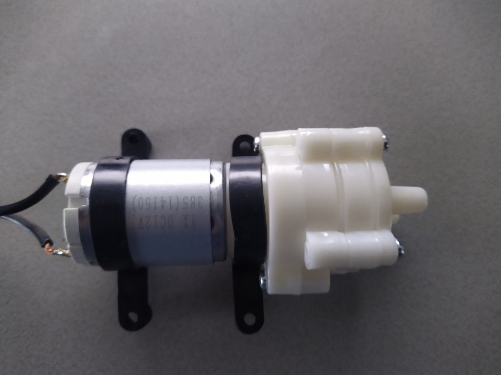

# ESP Bottle Filler

## Description

ESP Bottle Filler is controller for timed bottle filling.

It is open source and build in c++ using esp-idf RTOS.

## Features

- Multiple Configurable Filler configs.
- Up to 6 Filler configs.
- Variable speed control.
- Auto Fill.
- Manual Fill.
- Control via Webinterface.
- Control via push buttons.


## Screenshots


## Supported Devices

It should work with pretty much with esp32 controller, but i only tested it with the XIAO ESP32-C3


## How to use (binary with loader)

Its recomended to flash with loader, that way you can always go into recovery mode and flash new firmwares over wifi.

- Download the binary loader release (esp-bottle-filler-loader-*.bin).
- Flash esp-bottle-filler-loader_*.bin to esp using your favorite flash tool.
    - Tasmota-PyFlasher-1.0
    - https://espressif.github.io/esptool-js/ (address 0x0)
    - https://github.com/espressif/esptool/ (esptool write_flash 0x0 esp-bottle-filler-loader_*.bin)
    - ...

- Download latest release (esp-bottle-filler-*.bin) to computer.
- Reboot device
- Connect to the wifi EspBottleFiller with password EspBottleFiller123
- Navigate to http://192.168.4.1
- Flash release
- Wait for reboot
- Goto Settings -> Wifi and configure your wifi.
- Restart Device
- Navigate to http://bottlefiller/
- Start Botteling!
- Ship or buy me a beer!

## How to use (source with loader)

Its recomended to flash with loader, that way you can always go into recovery mode and flash new firmwares.

- Build and flash the loader.

```bash
cd loader
idf.py fullclean
idf.py set-target esp32
idf.py build flash monitor
```

- Connect to the wifi EspBottleFiller with password EspBottleFiller123
- Navigate to http://192.168.4.1
- Build latest release

```bash
idf.py fullclean
idf.py set-target esp32
idf.py build
```
- Flash release (build/esp-bottle-filler.bin)
- Wait for reboot
- Goto Settings -> Wifi and configure your wifi.
- Restart Device
- Navigate to http://bottlefiller/
- Start Botteling!
- Ship or buy me a beer!

## How to use (source without loader)

- Build and flash.

```bash
idf.py fullclean
idf.py set-target esp32
idf.py build flash monitor
```
- Connect to the wifi EspBottleFiller with password EspBottleFiller123
- Navigate to http://192.168.4.1
- Goto Settings -> Wifi and configure your wifi.
- Restart Device
- Navigate to http://bottlefiller/
- Start Botteling!
- Ship or buy me a beer!

## Setup Dev Enviroment

install esp-idf >= 5.1.2

run . ./export.sh in esp-idf folder


## Configure the project

```bash
idf.py fullclean
```

```bash
idf.py set-target esp32c3
```
valid targets are: esp32, esp32s2, esp32c3, esp32c6, esp32h2, esp32c2, esp32s3

```bash
idf.py menuconfig 
```

Go into "BottleFiller Config" and configure wifi and IO's.


## Build and Flash

Build the project and flash it to the board, then run monitor tool to view serial output:

```bash
idf.py build flash
```

*Depending on your device you might need to set it into flash mode, typically: Hold both the BOOT and RESET, then release RESET.


## Factory Reset

To factory reset the device and all the settings run the command below, you will then have to reflash the loader and app!

```bash
idf.py flash_erase
```


## Build Web (optional)

It is optional since the last build html should also be checked into git.

To update the web build:

```bash
cd web
yarn build
cd ..
./updateweb.sh
```

*on build issues first delete tsconfig.tsbuildinfo

## Wifi

To configure wifi either do idf.py menuconfig, and configure wifi SSID and password, or let esp-bottle-filler start an access point wich you can connect to and configure wifi in the webinterface.

Be sure to at least change te password!, but it is also recommended to swith to station mode instead of ap!

Default Wifi settings are:
SSID: EspBottleFiller
Password: EspBottleFiller123

## Connecting with Browser

Just open your browser and enter http://BottleFiller, or if still in access point mode http://192.168.4.1

Hostname can also be changed via menuconfig.

*Dns does not work when in access point mode, esp-idf doesn't have a dns server atm. 


## Debug

```bash
idf.py monitor 
```

To quit Ctrl-T Ctrl-X.


## Connect Pumps

Pump are connected using a IRLB8743 N-MOSFET so speed can be controlled.


Pump that is used is a "DC 12V R385 Priming Diaphragm Mini Pump"



## Connect Buttons

Buttons are just connected to ground and pulled down.


